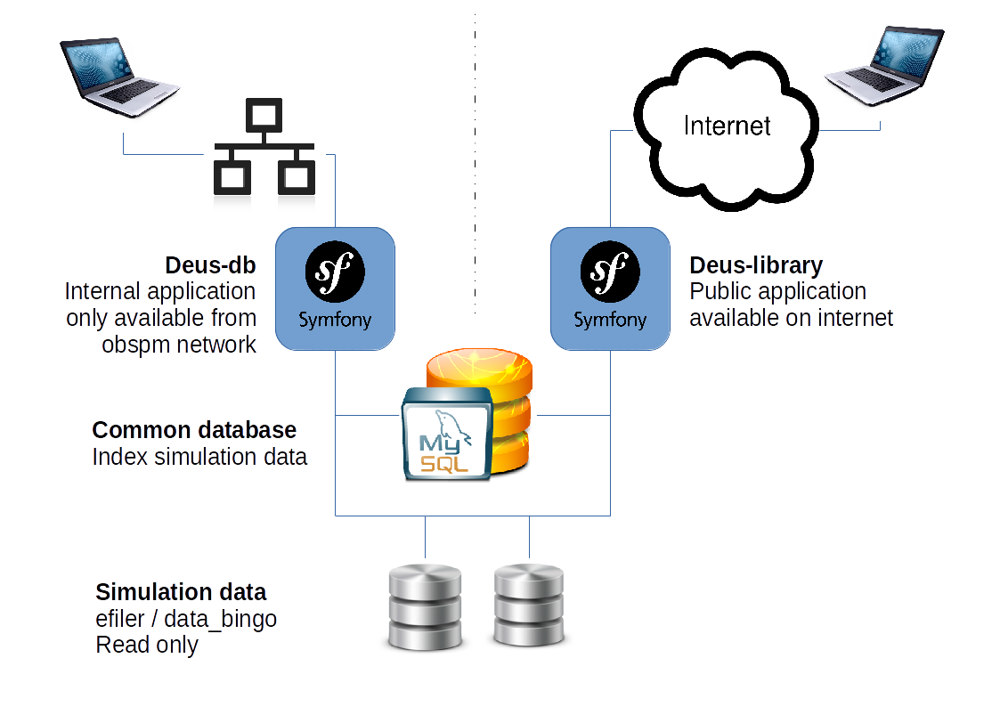
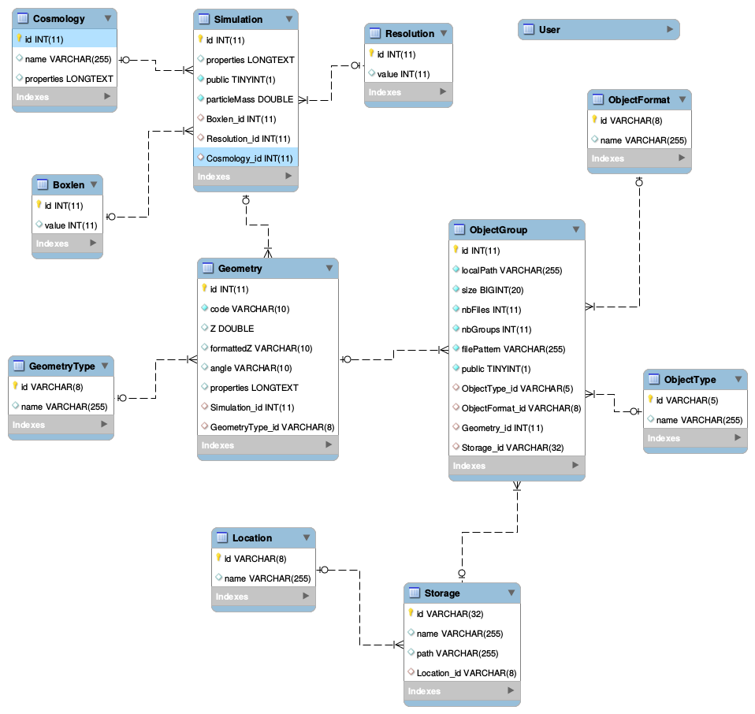
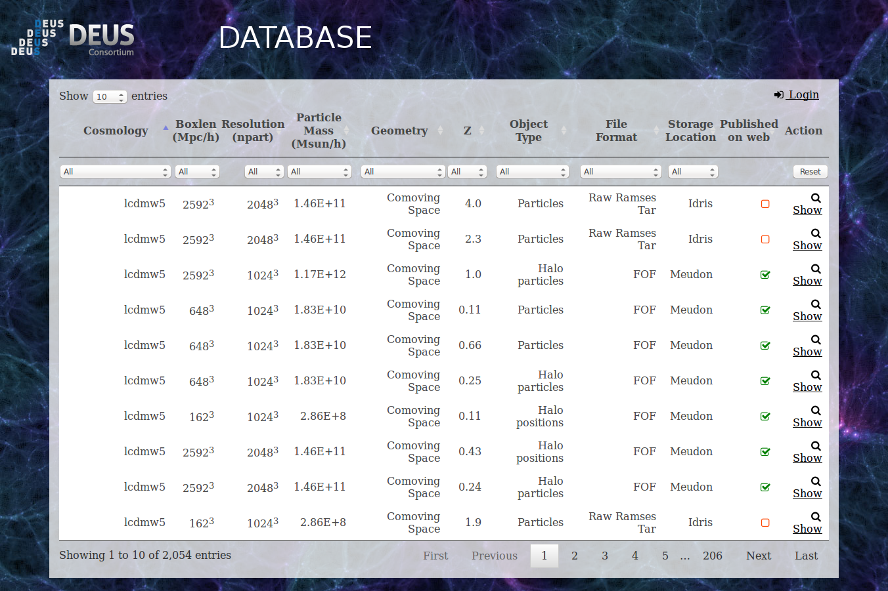
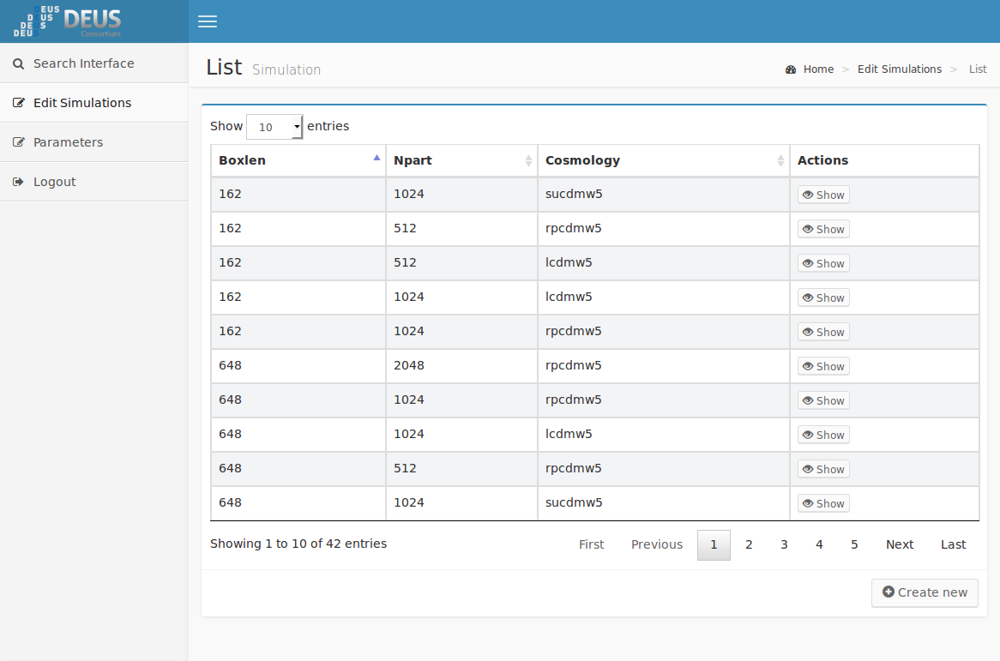
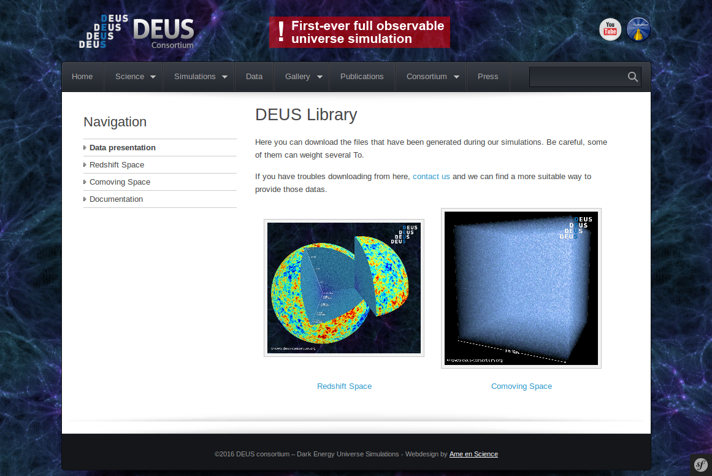
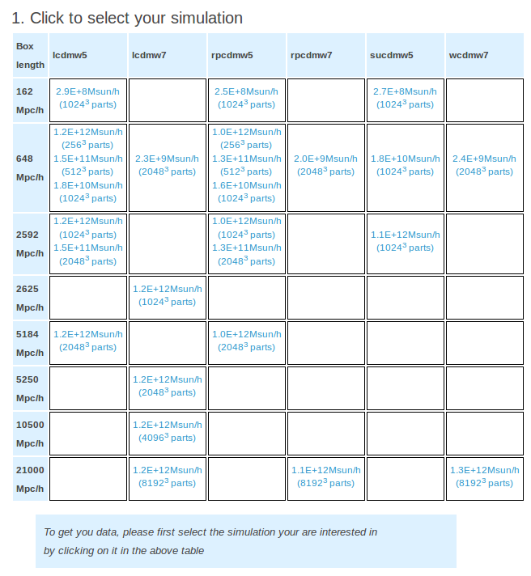
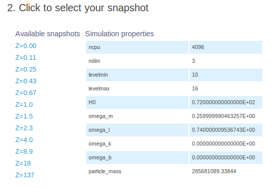
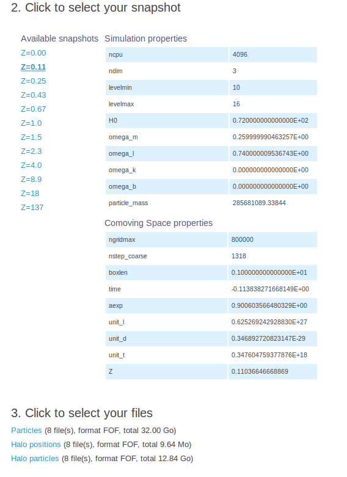
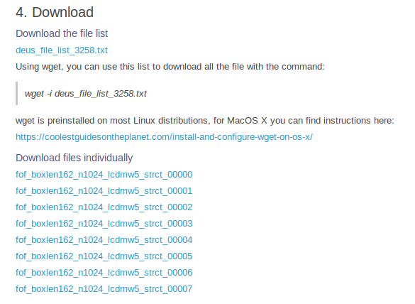

DEUS DATABASE
=============
by Jean Pasdeloup - 2016-16-03 - Draft

Global architecture
-------------------

The system is composed of a common database used by two separate web applications:
 - deus-db: application to search/edit/import data, only available from the obspm network
 - deus-library: public application to search/download data, available from the internet



Data Model
----------



Quick version: the database contains ObjectGroups (ie groups of files of a certain type/format) that are parts of a Geometry (ie a cone or snapshot) that belongs to Simulations.

### ObjectGroup

ObjectGroup is the main object in the database, it represents a group of files generated from a Simulation in a directory.
It has an ObjectFormat, an ObjectType, a Storage, and belongs to a Geometry.

### ObjectType

ObjectType is a reference table to indicate the kind of file. It can be particle, halo position, particles of halo, etc.

### ObjectFormat

ObjectFormat is a reference table to indicate the technical format of the files. It can be FOF, Ramses, HDF5, etc.

### Storage

Storage represents the place where the data are located. It is both a path and a Location like efiler1 in Meudon, or storedir in TGCC.

### Location

Location represents the physical Location of the Storage. It can be Meudon, TGCC, Idris.

### Geometry

Geometry is a volume from a simulation containing object, ie a snapshot, a cone, a sample.
It has a GeometryType, several ObjectGroups and belongs to a Simulation.

### GeometryType

GeometryType is a reference table to indicate the types of Geometry. It can be snapshot or cone.

### Simulation

Simulation is a run of a cosmological code.
It has a Boxlen, a Cosmology, a Resolution, and several Geometries.
Note: it is not possible yet to have several simulations with the same characteristics (Boxlen + Cosmology + Resolution). When the import code find objects it tries to add them to an existing Simulation and only creates a new one if it can't find.

### Boxlen

GeometryType is a reference table to indicate the Boxlen in Mpc/h.

### Cosmology

GeometryType is a reference table to indicate the Cosmology. It has properties that can be set using the administration.

### Resolution

Resolution is a reference table to indicate the Resolution in part^1/3

Interface Usage
---------------

### DEUS-DB Search

This interface allows the user to search for objects and get informations about it.
It also allows to simplifly access to edition and publication.

#### Simple search usage



The basic feature of DEUS-DB is not allow simple search among simulation objets

#### Link to edition

On the top, a link to "Login" allow to connect as admin.

Admin will have new features on this top bar:
- access to publication mode
- access to administration
- link to export: to get an Excel file of the list
- logout

When logged, edit buttons will also appear on the detail popup.

#### Publication

When logged, the administrator can use the publication mode to select the Objects he wants to be public using the checkbox.
Note: no need to validate, the action is immediate.

### DEUS-DB Admin

This interface allows the user to edit settings and the datas.



### DEUS-Library

This is the public interface for visitors. They can select simulations then objects and download them directly.

Note: for an ObjectGroup to be visible on DEUS-Library, both the ObjectGroup and the corresponding Simulation should be set to "public".
Also, only Simulations with at least one public ObjectGroup appear.



The simulations are sorted in a table by box length and cosmology. In each cell, you'll find the available resolution for the combination.
Just click on the one you want to select it.



When selected, the simulation properties appears below as well as the available snapshots.



When a snapshot is selected, his own properties appear below the simulation ones as well as the available objects and their formats.



When an object is select, the corresponding files appear to be downloaded.



It is both possible to download the file list as a text file to use with wget, or to download files individually

New Simulation/File integration
-------------------------------
Integrating new data is a 2 step procedure:
 1. gather data into an index directory from the server using a bash script makeDeusIndex.sh
 2. parse the index using rules in the PHP application to import data into the database

### Make index with bash

``
    bin/makeDeusIndex.sh
``

This file should be copied on the server owning the data, and the settings in it need to be changed.

```
####################
# CONFIG           #
# Please edit here #
####################

# DIRECTORY TO FIND THE FILES, CAN USE WILDCARD
#   example: "/data_bingo/Babel/boxlen*"
ROOT_DIR="/efiler1/Babel_le/boxlen*"

# STORAGE ID IN THE DATABASE, CURRENT VALUES ARE:
#   "meudon_bingo_data": /data_bingo/ in Meudon
#   "meudon_efiler_data1": /efiler1/ in Meudon
#   "meudon_efiler_data2": /efiler2/ in Meudon
#   "meudon_asisu_deus_data": /asisu/deus_data/ in Meudon
#   "idris_ergon_storedir": $STOREDIR on Ergon / IDRIS
#   "tgcc_curie_storedir": $STOREDIR on Curie / TGCC
# More can be added directly on the database
STORAGE="meudon_efiler_data1"

# DIRECTORY FOR THE INDEX (DEFAULT: USE STORAGE NAME ON LOCAL PATH)
INDEX_DIR=./${STORAGE}_Babel_le
```

### php import

``
    app/console deusdb:import_index <path> [ruleset]
``


### edit import rules

The rules files is located into app/config/

#### deus_cones.yml

```
parameters:
  deus_cones:
      output_cone:
        Z: 0
        angle: FullSky
      output_cone_1:
        Z: 0
        angle: FullSky
      output_cone_5:
        Z: 0.5
        angle: FullSky
      output_cone_6:
        Z: 1.2
        angle: FullSky
```

#### deus_files.yml

```
parameters:
  deus_files:
      default:
          snapshot_cubes:
            path: ""
            dir_pattern: "cube_<number>"
            geometry_type: snapshot
            file_pattern: "fof_boxlen<boxlen>_n<npart>_<cosmo>_cube_<number>"
            file_type: cube
            file_format: fof
          snapshot_masst:
            path: "post/fof/"
            dir_pattern: "output_<number>"
            geometry_type: snapshot
            file_pattern: "fof_boxlen<boxlen>_n<npart>_<cosmo>_masst_<number>"
            file_format: fof
            file_type: masst
      curie:
          curie_cubes:
            path: "post/multi"
            dir_pattern: "output_<number>"
            geometry_type: snapshot
            file_pattern: "fof_boxlen<boxlen>_n<npart>_<cosmo>_multicube_<number>"
            file_format: multi
            file_type: cube
```

(Re)Installation
----------------
### Prerequisites

 - PHP 5.5
 - mysql 5
 - composer

### deus-db Installation

```
git clone https://luthgit.obspm.fr/deus-db.git
cd deus-db
# droits !
composer install
app/console c:c -e prod
app/console assetic:dump -e prod
./reset.sh
```

### deus-library Installation

```
git clone https://luthgit.obspm.fr/deus-library.git
cd deus-library
# droits !
composer install
app/console c:c -e prod
```

### Roxxor2/ installation


